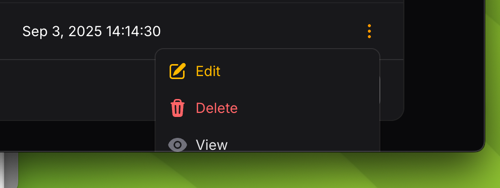
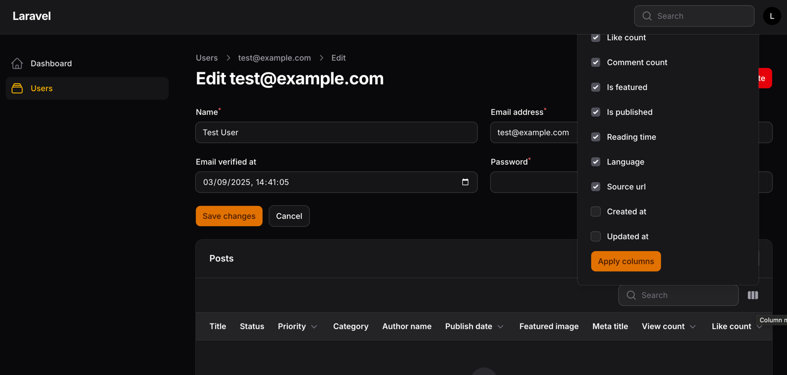

# Action menu Bug Report

Seed some users to populate a table with some rows
```bash
php artisan db:seed
```
Goto /admin/users and click the 3 dots on the last row of the table.

Action group menu is cut off and no way to scroll down.


Filament 3 used some kind of flip magic to make the menu appear from bottom up not top down.


## Column manager bug

When using a relation manager the column manager pops up from bottom to top and disappears off the screen.
There is no way to access the hidden check boxes

